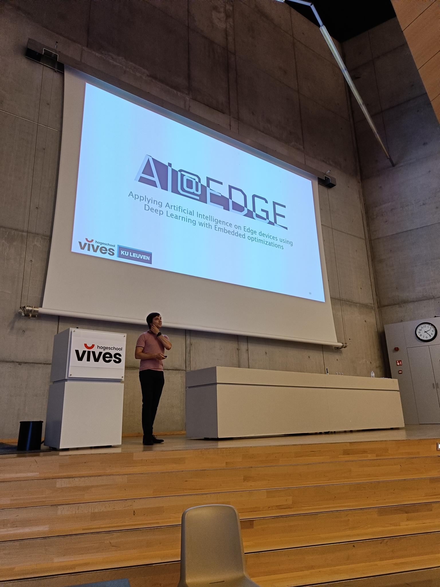
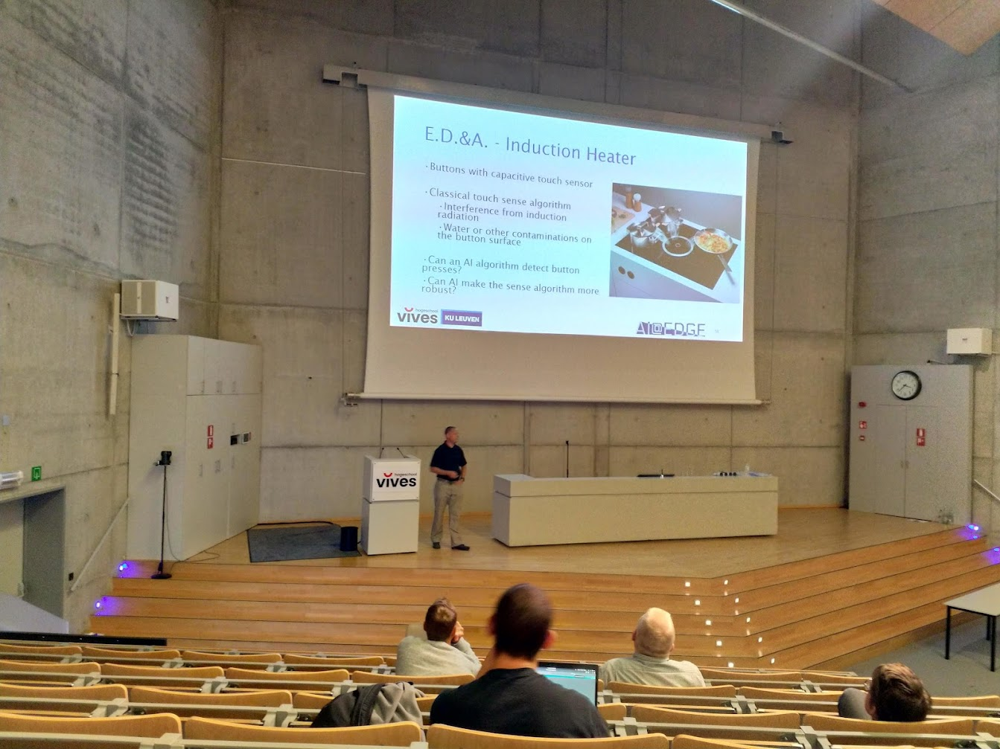
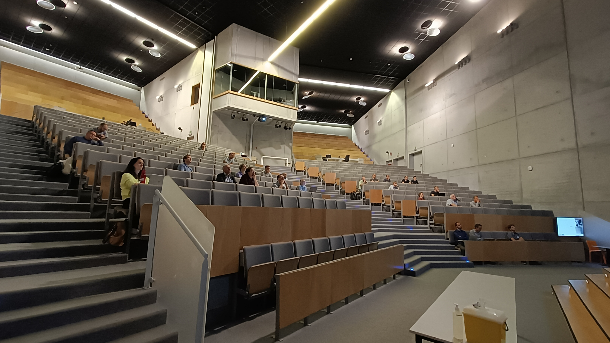
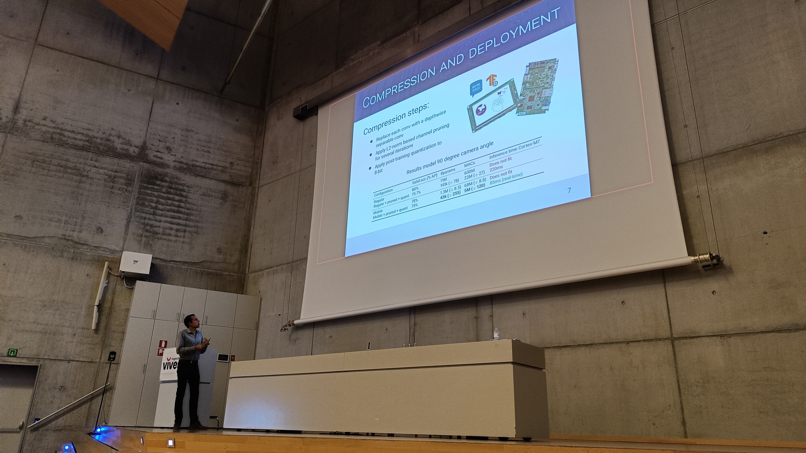
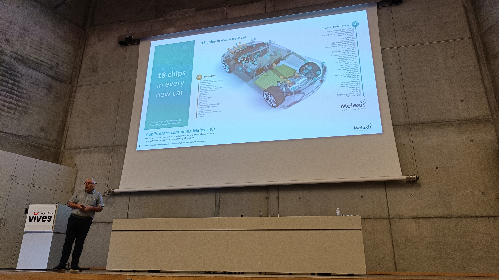

# Final Symposium

Date: 21 July 2022  
Location: Aula VIVES Hogeschool, Xaverianenstraat 10, 8000 Brugge

* Attendees:
  * Kris Bellemans (E.D.&A.)
  * Wouter Reusen (Melexis Technologies nv)
  * Luc Buydens (Melexis Technologies nv)
  * Stefan Schulte (Teledyne FLIR)
  * Robbe Goetehals (Citymesh)
  * Koen Vandeputte (Citymesh)
  * Michel Dequick (Teledyne FLIR)
  * Kevin Vandecasteele (Fanuc Benelux)
  * Nicolas Maes (Picanol)
  * Paschalis Tsiaflakis (Nokia Bell Labs)
  * Marcel Verhoeven (CNHi)
  * Karen Feyen (Thomas More Hogeschool)
  * Geert Vanstraelen (Macq)
  * Wim Glorieux (Chilli Robotics nv)
  * Thomas Nauwelaerts (NiniX Technologies)
  * Michel Hillen (Atlas Copco)
  * Carl Declercq (TVH Parts Waregem)
  * Robbe Fouvry (AVR)
  * Pieter Verstraete (AVR)
  * Frederik De Vusser (VLAIO)
  * Maarten Vanhoucke (Vanhoucke Machine Engineering)
  * Pedro Calleeuw (VIVES)
  * Freja Gheysen (VIVES)
  * Steven Hollevoet (VIVES)
  * Peter Vanbiervliet (VIVES)
  * Nico De Witte (VIVES)
  * Ruben Buysschaert (VIVES)
  * Geert Calu (VIVES)
  * Steve Simons (VIVES)
  * Griet Verbeke (VIVES)
  * Astrid Stroobandt (VIVES)
* Project team members:
  * Toon Goedemé (KU Leuven - De Nayer)
  * Kristof Van Beeck (KU Leuven - De Nayer)
  * Maarten Vandersteegen (KU Leuven - De Nayer)
  * Sille Van Landschoot (VIVES)
  * Jonas Lannoo (VIVES)

## Information

## Presentation Slides

Preview:  
@[pdf](https://ai-edge.be/AI-EDGE-Slotsymposium.pdf)

Open the presentation in a new page:  
[Final symposium slides](https://ai-edge.be/AI-EDGE-Slotsymposium.pdf)

## Event pictures

