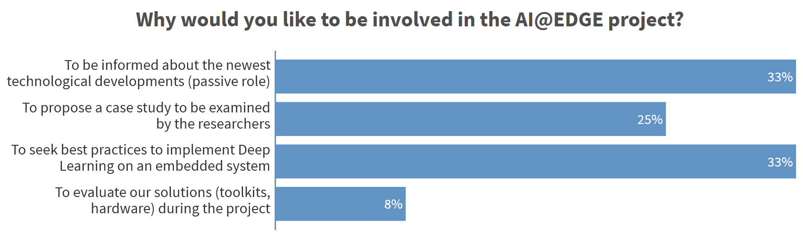
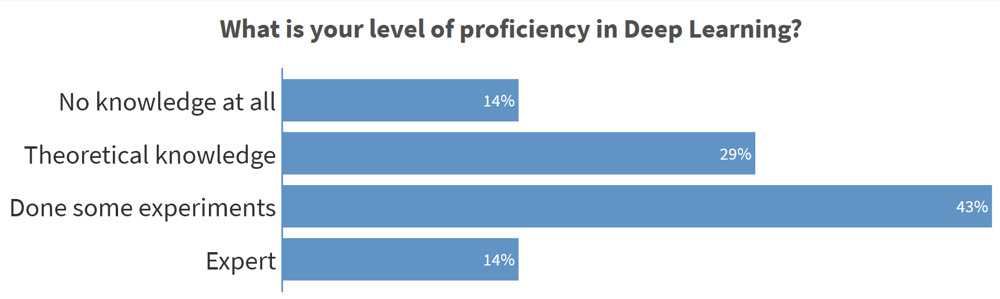
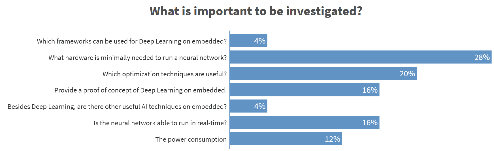
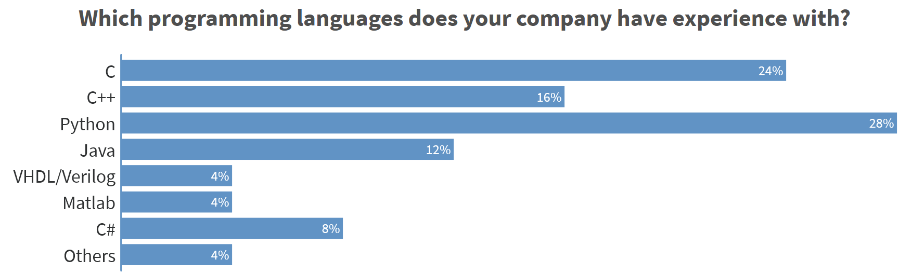
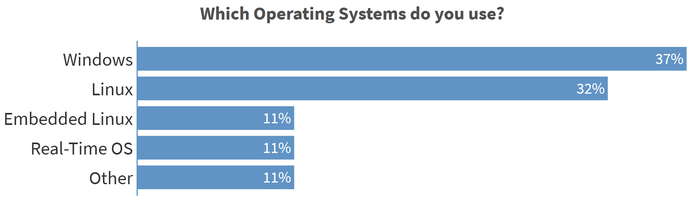
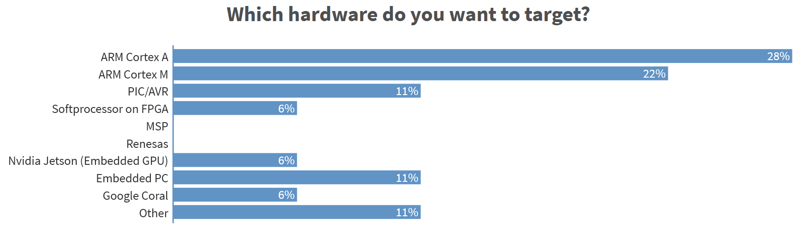
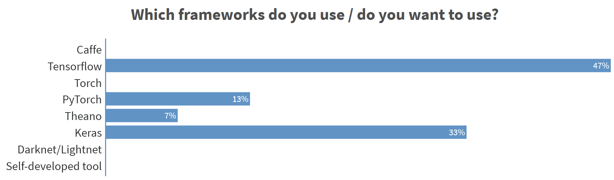
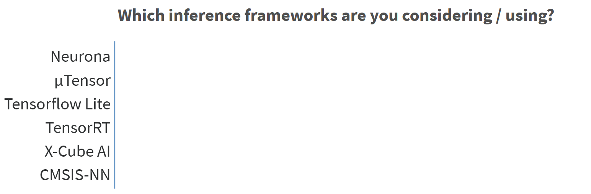
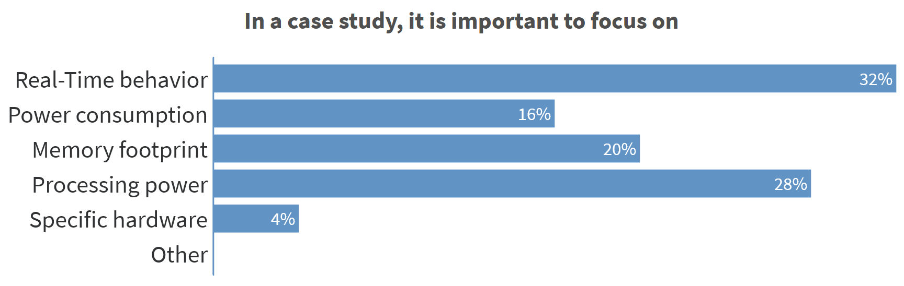
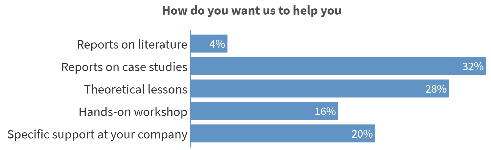

# Kick-Off Meeting

Date: 03 march 2020

* Present:
  * Willem Romanus (6Wolves)
  * Fabrice Verhaert (6Wolves)
  * Gert Van de Wouwer (Digipolis)
  * Daan Pape (DPTechnics)
  * Bjorn Van De Vondel (DSP Valley)
  * Kris Bellemans (E.D.&A.)
  * Nick Destrycker (Edgise)
  * Chandu Kancharla (KU Leuven - Brugge)
  * Ben Minnaert (Odisee)
  * Xavier Chesterman (Picanol)
  * Patick Puissant (Picanol)
  * Rieko Adriaens (Qmineral)
  * Edouard Charvet (Scioteq)
  * Frank Allemeersch (Sensotec)
  * Peter Papics (Transport & Mobility Leuven)
* Excused:
  * Luc Buydens (Melexis)
  * Anke Van Campen (VLAIO - project advisor)
* Project team members:
  * Toon Goedemé (KU Leuven - De Nayer)
  * Kristof Van Beeck (KU Leuven - De Nayer)
  * Maarten Vandersteegen (KU Leuven De Nayer)
  * Piet Cordemans (VIVES)
  * Sille Van Landschoot (VIVES)
  * Nico De Witte (VIVES)

[User group meeting slides](https://www.slideshare.net/secret/IKXSU9bglFMYA)

## Introduction

* Introduction of IoT incubator
  * low power embedded prototypes
  * edge computing
* Introduction of EAVISE
  * image processing and AI for industrial applications
  * real-time processing of vision algorithms
* Organisation of the project
  * 1/3  KU Leuven 
  * 2/3 for IoT Incubator)
* Goal of a TETRA project
  * Transfer practical knowledge to companies
  * Fit new state of the art technologies to companies needs

## Project Goals

* Training a model requires memory and computing power. Once trained we can run the model on smaller systems. 
  * What are the boundaries?
  * How small can we effectively go?
  * What are the trade-offs?
* Focus on deep learning

## Demo

* Yolo v2, a real-time object detection algorithm, on Jetson TX2 and TensorRT gets a framerate of about 20fps.
* KU Leuven has trained a patch to confuse the model and disable person detection.
* Pretrained networks can relief you from a huge part of the training. Then retrain for more specific case. This is called transfer learning.

## Research Questions

* What are the possibilities and applications for Deep Learning on low-cost embedded hardware?
* Which hardware is suited for these Deep Learning applications, and which trade-offs need to be made?
* What are the available software libraries and frameworks, and how do they work?
* What is the influence on the accuracy when using such embedded devices?
* What are the consequences for the power usage of the system?
* How can we improve the latency of the embedded system using local autonomous decisions?

## Partners

Partners introduced themselves, their company and the goals they want to achieve in the AI@EDGE project.

* 6WOLVES
  * Contact person: Willem Romanus
  * Sports tech company - startup
  * Develop a wearable for recognition of human activity
  * Goals:
    * Explore deep learning
    * Autonomy and real-time feedback are important
    * Battery powered devices
  * Use case: version of their wearable with DL so they don't need a cellphone anymore

* Digipolis
  * Contact person: Gert Van de Wouwer 
  * Environmental agency - ICT company for Antwerp (OCMW, citizens, fire brigade)
  * Goals:
    * Use open source technologies to reduce vendor lock-in and reduce costs
    * A lot of data is gathered and they want to use this for more intelligent stuff
  * Use case: apply vision on the edge, recognition of littering in the streets, improve city mobility, check for parking tickets, broken traffic signs

* DPTechnics
  * Contact person: Daan Pape
  * In house development of IoT devices with a focus on edge computing
  * Full stack deployment with all logic on the end device
    * Capture data and do some simple analytics
    * BlueCherry is used to access the data on these devices
  * Goals:  
    * AI is evolving - time to check for other possibilities
    * Using commodity hardware - single or dual core MIPS processors 32MB - 256MB of memory
  * Use cases:
    * Dual Core 888 MHz MIPS to do license plate recognition - 0.25 fps (too slow) - about 80% acc
    * Accelerometer data analytics - normal operation or fault - fishing vessels are monitored with 4 to 5 combustion engines and detect if they are running normally by attaching accelerometer to the engine - AI could improve this

* DSPValley
  * Contact person: Bjorn Van De Vondel
  * DSP => Embedded => Smart => IoT
    * Back to edge computing
    * More focus on business development (health care, smart industries)
  * Goal: Valorization partner (distribute research results)

* ED&A
  * Contact person: Kris Bellemans
  * Custom electronics
    * HVAC, Water treatment, laundry, food, agriculture, ...
  * Goal: general interest in AI and NN and particular in applications on small microcontrollers.
  * Already exploring AI since fall 2018 (bachelor thesis)

* Edgise
  * Contact person: Nick De Stryker
  * Custom hardware design for edge 
  * Proof of concepts: Google Corals, Jetson nano's, also FPGA's
  * Goals:
    * Mapping available things
  * Use cases:
    * Speech context recognition is gaining trackion so that is important once
    * City project: detect people, detect facial expressions

* Melexis
  * Contact person: Luc Buydens 
  * Use case:
    * Small thermal infrared sensor applications. For example hand recognition in cars. Works already, but now it needs to be optimized

* Picanol
  * Contact person: Patrick Puissant
  * Weaving machines
  * Goals
    * Already started to collect data of weaving machines
    * Edge computer is collecting this data and sending to server
    * Can AI play role in making machines smarter
    * Less expensive hardware for AI in the machine. What are minimal requirements? Can we run standard toolings on these? What can be run in the cloud and what should be run on the edge? Application in the field of controllers.

* Qmineral
  * Contact person: Rieko Adriaens
  * Independent material test lab
    * Analyse soils, dust, minerals, ...
    * Needs manual interpretation of spectrum, whole workflow that is very labour intensive
    * Lots of difference in accuracy in different labs
  * Goals
    * Can this process be less labour intensive by applying AI?
    * Can this be done at the client?
  * No specific use case at the moment

* ScioTeq
  * Contact person: Edouard Charvet
    * Avionics division of Barco
      * 3 markets: avionics displays, rugged solutions (ex. submarines) and air traffic control solutions
  * Goals
    * Big trend to introduce AI in aircraft - no certification for AI software (there is a working group focusing on this)
    * Constrained systems (weight, power, size)
  * Use case:
    *Autonomous landing of air craft (compute 6D pose) - use camera on the aircraft to detect runway's, hangars, taxi's, ... then feed to autopilot. Can a Neural Network be used for this?

* Sensotec
  * Contact person: Frank Allemeersch
  * Assistive technologies for persons with a reading/writing impairment or visual disability
  * Software for people with dyslexia (writes phonetically) - switched from windows app to web app
  * Goals:
    * Use Deep Learning for the word prediction part
    * Use of web client on for example chromebook

* TML
  * Contact person: Peter Papics
  * Telraam - traffic counting 
  * Low Cost hardware 
  * Open CV
  * multi-model
  * Goals
    * speed estimate
    * classification is simplistic and could be improved
    * Classification is being done on the server (can this be done on the RPi)

* Odisee:
  * Contact person: Ben Minaert
  * AISiBoCo (TETRA AI project)
  * Goal: Build central generic hub with sensors

* KU Leuven Bruges
  * Contact person: Chandu Kancharla
  * Retrofit machines with sensors and put back in industry 4.0

## Poll Everywhere

We conducted a poll with the members of the user committee present. These are the results:

Note: exploratory work on inference frameworks is needed

## Future work

* Exploration of (inference) frameworks
* Selecting use cases

## Other Sites

* [Start to Deep Learn](https://iiw.kuleuven.be/onderzoek/eavise/starttodeeplearn/home)
* [EAVISE](https://iiw.kuleuven.be/onderzoek/eavise)
* [IoT Incubator](https://iot-incubator.be)
