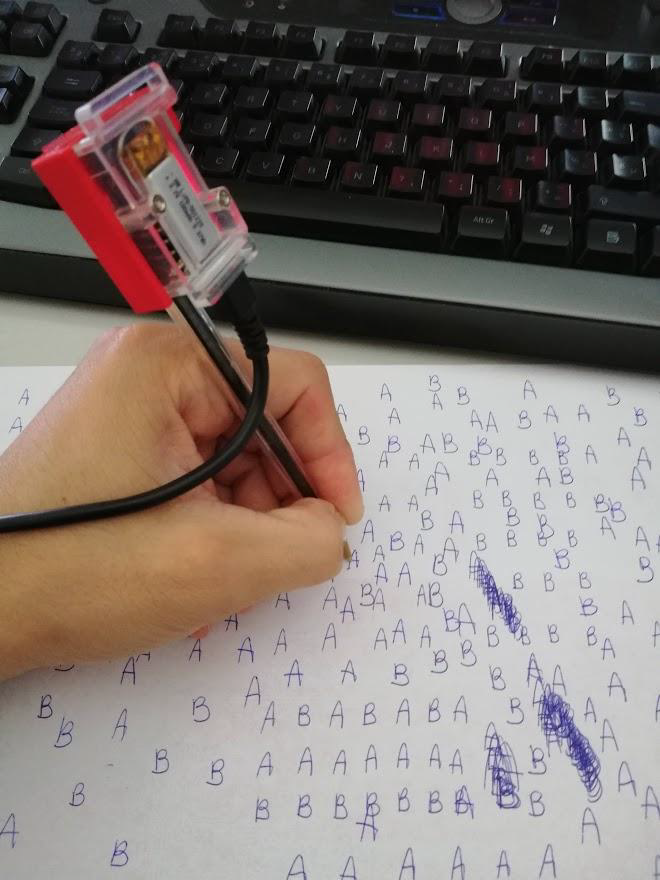

# Use case: AB Writing
Academic example

## Goal
This academic use-case was the preparatory phase for the workshop on Edge Impulse. This use-case is used to show the strengths of the Edge Impulse framework and the possibility of classifying repeatable movement from handwriting, what would be difficult to detect using traditional methods.
The use-case makes use of a 3D printed cradle that carries a small microcontroller (STM Sensortile) and that is mounted on a pencil. The movement when writing letters, numbers or symbols is detected by an accelerometer and transferred to the Edge Impulse framework. There the data is labeled and split into a training and testing dataset. A Deep Learning model is trained and validated and finally the model is infered back on to the STM Sensortile. By writing a symbol, the model classifies and reports which letter has been written.

For more information about this use-case, we refer to the information of the workshop ([Embedded Vision](workshops/edgeimpulse)) or contact us using the information below.

## Contact

For more information please contact:  
**dr. ing. Jonas Lannoo**  
<jonas.lannoo@vives.be>  
**ing. Sille Van Landschoot**  
<sille.vanlandschoot@vives.be>

