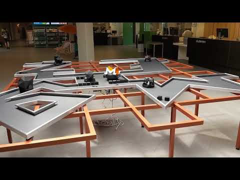

# Use case: Crypto Miner Car
Company: LarbitsSisters/LarbitsLab

## Goal
The artist duo LarbitsSisters created an art concept called the CMC (Crypto Miner Car). The concept exists out of four autonomous vehicles that can drive around and each represent a different cryptocurrency. Below the platform where they drive on, a workstation is "mining" those four cryptocurrencies. The goal is to let the vehicles drive around autonomously on that platform (which also has the shape of the logo of the cryptocurrency) and let them charge up autonomously. The energy to charge them is deliverd by recovering the heat that is generated by the GPUs that are mining the cryptocurrencies.

The problem of this project is that the autonomous driving is not working properly. The vehicles have a camera and three distance sensors aboard. The AI component has to be implemented in a Raspberry Pi 3 computer. The solution here was to use the Floodfill algorithm, divide the camera image in 11 segments and find the most distant point. The best driving direction was then concluded using the Q-learning. The three distance sensors are an addition to the vision-algorithm performed on the camera image, so that it keeps track of the road to drive on an not bumps into the edges of the track. The conclusion is that the algorithm works, but the vehicle is too large for the tracks on the platform, in addition, the vehicle is not able to rotate 180 degrees (required for dead-ends), is mechanically weak, slow and has problems with lighting. Therefore, the vehicle was redesigned and now uses 7 distance (Time of Flight) sensors and works without camera. It uses again the forcefield algoritm to find its path. This concluded in a much more agile, faster and reliable vehicle.

A full description of this use-case can be found [here](https://ai-edge.be/LarbitsSisters_CMC.pdf).
For more information and to get access to the data and code, please contact the following persons below.

## Contact

For more information please contact:  
**Prof. Toon Goedemé**  
<toon.goedeme@kuleuven.be>  
**dr. ing. Kristof Van Beeck**  
<kristof.vanbeeck@kuleuven.be>

