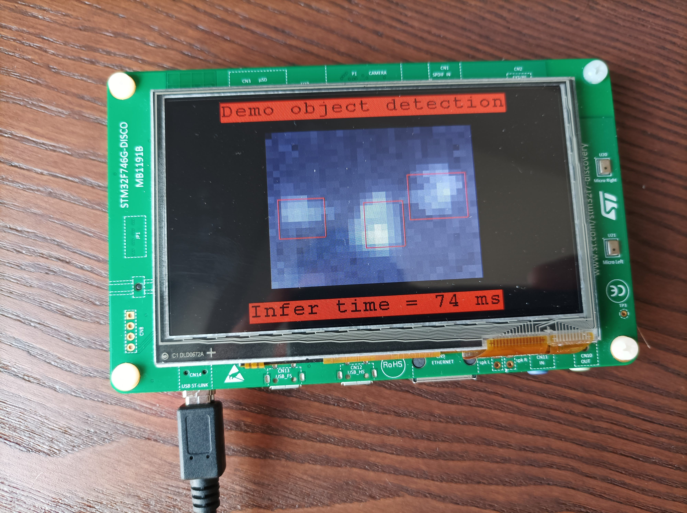

# Use case: Person Detection with Thermal Sensor
Company: Melexis

## Goal

This project aims to develop a low-cost person detector based on the low-resolution MLX90640 thermal imager. Amongst many applications, such a detector is useful in smart airconditioners to help point the airflow in the desired direction, away from people occupying the room.
To keep the overall cost of the detection system low, the bulk-price of the processor that needs to run the detection software within the air-conditioner unit, must not exceed approximately 8 euros, as specified by Melexis, the company who manufactures the MLX90640 and proposed this use-case.

Melexis already developed software for detecting persons with this sensor, based on traditional hand-crafted image processing techniques. In this project we aim to investigate if machine-learning can do better and help improve the detection accuracy of their current algorithm, given the constraints of the low-cost processor.

## Results
### Recording a dataset

In order to train a machine-learning based object detector on the low-resolution (32x24 pixels) thermal images, a large dataset is collected of over 90k images with bounding-box annotations. To lower the burden of manual annotation, our recorder devices have a high resolution colour camera in addition to the MLX90640. Bounding-boxes are derived from the colour camera video by an existing object detector model and a multi-object tracker. After manual inspection and correction of the tracked bounding-boxes on the colour images, these bounding-boxes are used as ground truth for the thermal images, which works since both cameras are calibrated to the same angle and have the same field-of-view.

### Proposed model and accuracy results

We propose a model based on Tiny YOLOv2 with a few modifications, in order to best fit the low resolution of the sensor. The model also consumes a *motion* image on a secondary input channel in addition to the regular thermal image. The motion image is created by subtracting a previous image from the current image, and provides the model with additional motion queues.
The model is trained on the recorded data and achieves an F1-score on the test set of 74% on images recorded from a 90 degree camera angle (top-down view) and an F1-score of 48% on images recorded from a 45 degree camera angle. Compared to the performance of the standard software, which achieves an F1-score of 88% and 62% for the 90 degree and 45 degree camera angles respectively, our current proposal does not work better. Our major point of failure is identified to be the lack of a long-term memory mechanism, which is present in the standard software in the form of a tracker. Future work could further improve our results by adding such a mechanism.

### Model compression

Our Tiny YOLOv2 variant contains 11M parameters and consumes 600M multiply-accumulates (MACs), which makes it impossible to fit this model into a processor of approximately 8 euros, like for example the STM32F7 microcontroller. We apply three steps in order to compress the model:

* Replace each convolution with a depth-wise separable convolution
* Apply iterative channel-pruning, which consists of several alternations between pruning and fine-tuning
* Apply post-training quantization to obtain an 8-bit model

The final model had a similar accuracy as the original one, but with a footprint of only 43k parameters and 5M MACs. The inference time is 85ms on an STM32F7 microcontroller for a single image.

## Contact

For more information please contact:  
**Prof. Toon Goedemé**  
<toon.goedeme@kuleuven.be>  
**ing. Maarten Vandersteegen**  
<maarten.vandersteegen@kuleuven.be>

