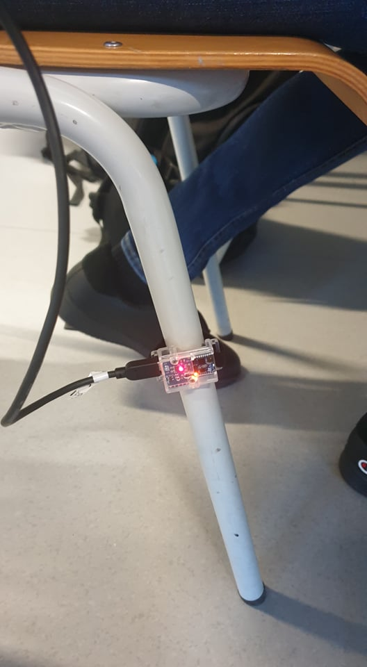

# Use case: Seat Detection
Academic example

## Goal
The functional requirement of this use-case is to detect the number of persons in a classroom, without the use of a camera to preserve the privacy of the persons.

This use case was investigated and solved by two groups of students. They both used accelerometers that were mounted to the leg of the chair to detect the movement and classified the measured vibrations. Some anomalies should be taken into account, namely the movement of nearby chairs, only moving the seat without sitting down (e.g. the cleaning personell passing by), other false positive movement of the chair. The groups approached the problem in two different ways.
The team of campus Bruges classfied the movement of the chair when either nobody is sitting down, or someone is actually sitting down using a feed forward neural network and Deep Learning. The small movements that a person makes is enough to destinguish both classes. Additionally, the team created a small mobile app to display the number of occupied seats.
The team of campus Kortrijk classified the forwards and backwards sliding of the chair to detect if someone is sitting down or standing up from the chair. They also trained a FFNN using Deep Learning and detected both movements.

## Results

The two student groups published their results in a repository on Github and a documentation page:
* [Repository Team Brugge](https://github.com/VIVES-AI-edge-computing/seat-detection-team-brugge)
* [Documentation page Team Brugge](https://ai-edge-raport.netlify.app/)
* [Repository & documentation Team Kortrijk](https://github.com/VIVES-AI-edge-computing/seat-detection-team-kortrijk)

## Contact

For more information please contact:  
**dr. ing. Jonas Lannoo**  
<jonas.lannoo@vives.be>  
**ing. Sille Van Landschoot**  
<sille.vanlandschoot@vives.be>

