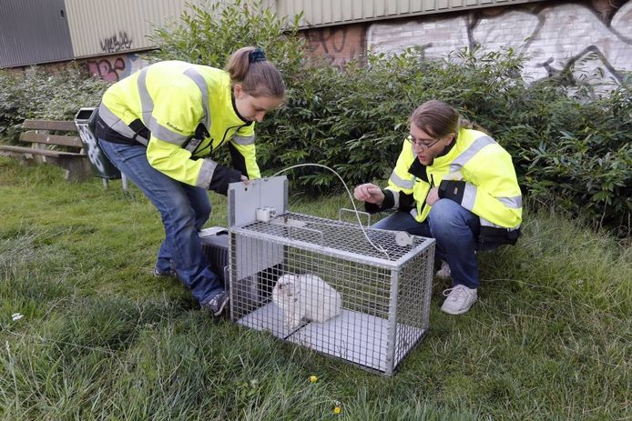

# Use case: Stray Cat Detection
Company: Municipality of Sint-Katelijne-Waver

## Goal
The municipality of Sint-Katelijne-Waver struggles with a number of stray cats that wander around. They want to solve this problem by placing cat-friendly cages around the municipality to capture the cats, identify them and bring them back to the rightworthy owner. Right now the cages have to be checked manually and periodically. They want to automate this process by adding a camera with a small computer and wireless connectivity to the cage. The system should detect when a cat has been captured using a Deep Learning algorithm. The system should notify the municipality that a cat has been captured. The picture taken from the camera can be immediatly uploaded to a database and shown on a website where found cats can be identified.

The use-case has been worked out by students during a bachelor's thesis, the pdf can be found [here](https://ai-edge.be/Bachelorproef_doc_Maurits_en_Sofie.pdf).

## Contact

For more information please contact:  
**Prof. Toon Goedemé**  
<toon.goedeme@kuleuven.be>  
**dr. ing. Kristof Van Beeck**  
<kristof.vanbeeck@kuleuven.be>

