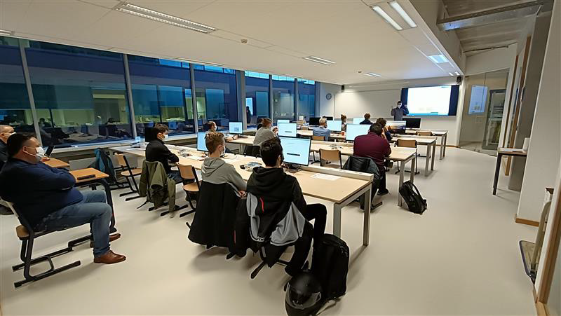

# Workshop Edge Impulse

In this workshop the basics of Deep Learning are explained using a "Hello World" example, specifically for AI applications. The workshop is an introduction to the tools and frameworks that are used to design Deep Learning applications and deploy them on a microcontroller. These tools consist of basic Linux usage, Jupyter Notebooks, the Mbed Operating system and environment and the high-level framework Edge Impulse. In this workshop you are going to go over the whole workflow twice, once as an introduction using the "Hello World" example, a second time with a specific application worked out in Edge Impulse. You will:
* prepare the device to collect data,
* collect actual data, 
* inspect the data, 
* prepare it for the neural network, 
* design the neural network,
* train the neural network,
* validate and optimise the neural network,
* quantise the weights of the neural network
* and deploy it to the embedded device.

Using this workflow and the Edge Impulse framework you can easily apply the methods to your own application.

For further information about the used hardware and tools, we refer to the manual of the workshop itself that can be found using the following link:

[Course material](https://ai-edge-workshop.netlify.app/)

## Want to join?

The workshop is regularly organised by the VIVES Hogeschool. Keep an eye on their [calender](https://www.vives.be/nl/over-vives/kalender) to find out if a new workshop is coming up!

A workshop can also be booked for a specific group, please contact us for further information:  
**dr. ing. Jonas Lannoo**  
<jonas.lannoo@vives.be>  
**ing. Sille Van Landschoot**  
<sille.vanlandschoot@vives.be>

